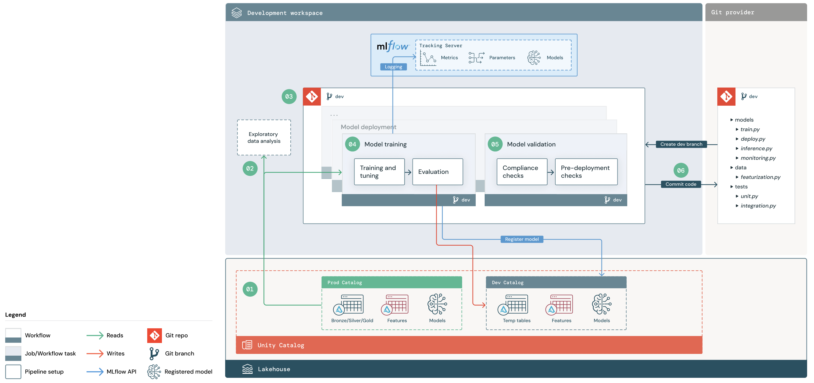
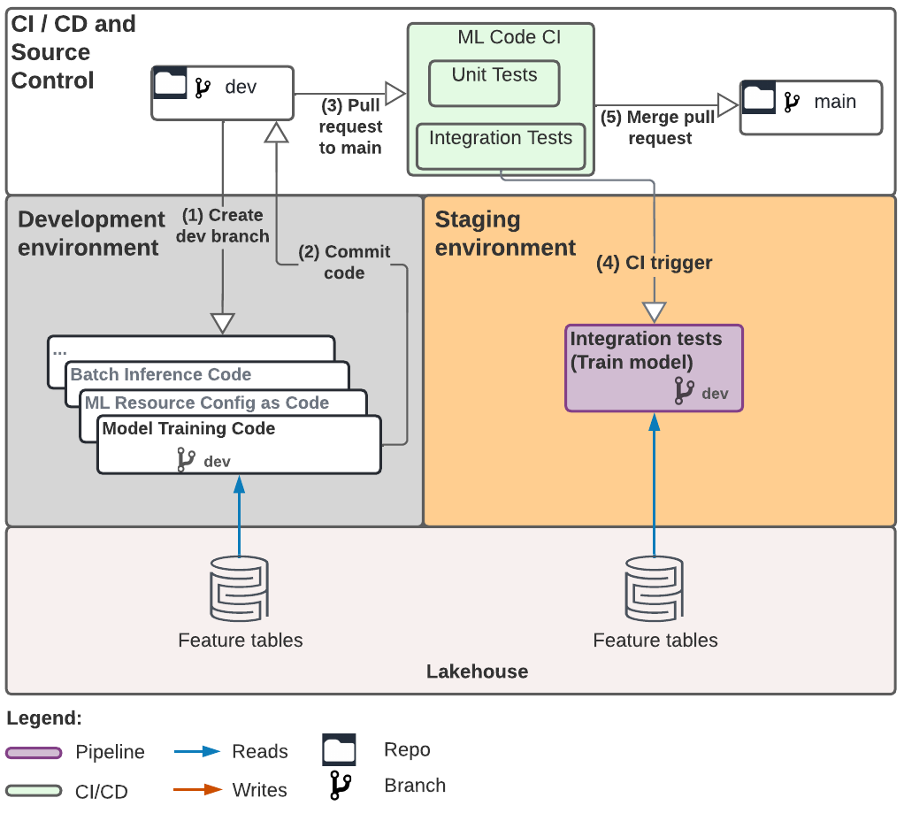
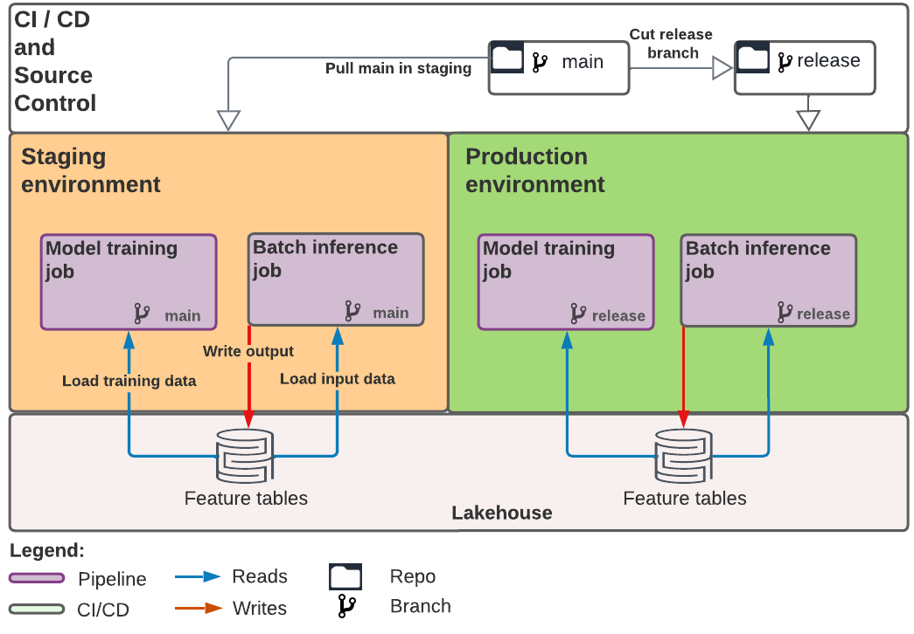
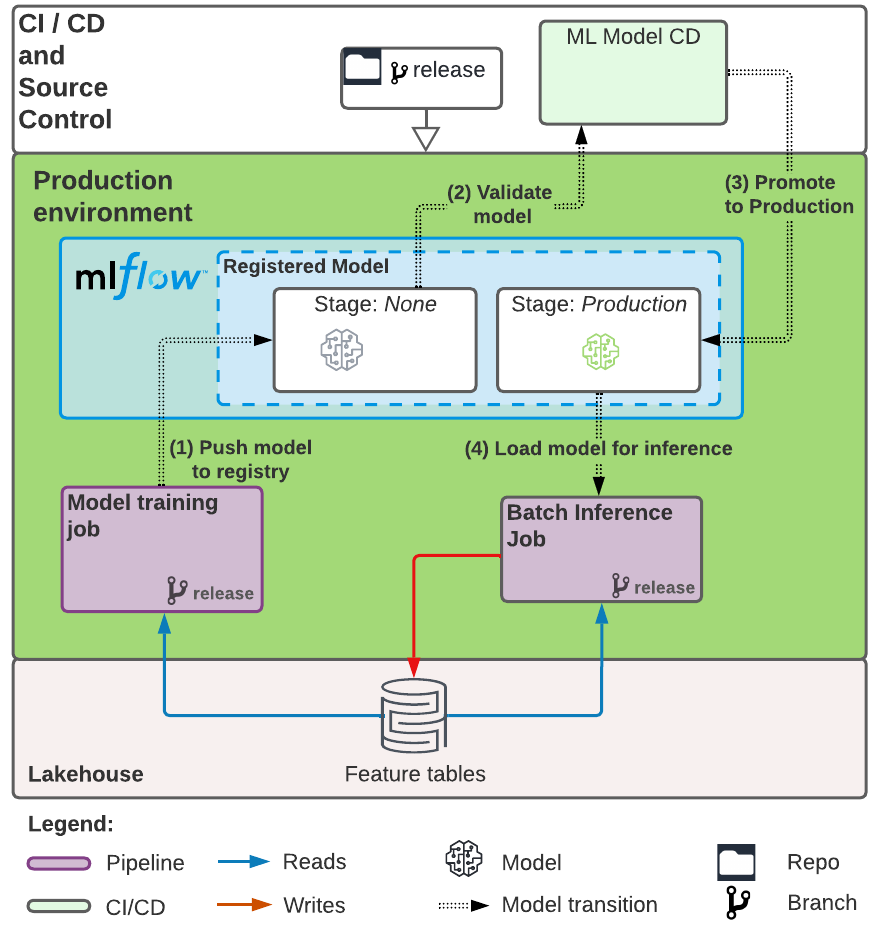

# ML Pipeline Structure and Devloop
MLOps Stacks contains an ML pipeline with CI/CD workflows to test and deploy
automated model training and batch inference jobs across your dev, staging, and prod Databricks
workspaces.

## Iterating on ML code
Data scientists can iterate on ML code and file pull requests (PRs):

This will trigger unit tests and integration tests that run model training 
code and any other desired validation (schema validation, feature testing, etc) 
in an isolated staging Databricks workspace:

## Deploying ML code
ML jobs in staging are configured to run against the default branch, so
will immediately update to run the latest code when PRs are merged.
Jobs in production run against a release branch. After merging a PR into main, you can
cut a new `release` branch as part of your regularly scheduled release process
to promote ML code changes to production:

## Model training pipeline
The model training pipeline trains and registers models to the model registry,
then triggers a CD workflow to perform any final checks on the model before
promoting it for deployment and use in batch inference. Here's how the batch and training pipelines interact
in production:

## Summary
Here's the whole pipeline in one picture:

For more details on MLOps on Databricks Lakehouse, please read [The Big Book of MLOps: Second Edition](https://www.databricks.com/resources/ebook/the-big-book-of-mlops).

[Back to README](README.md)
