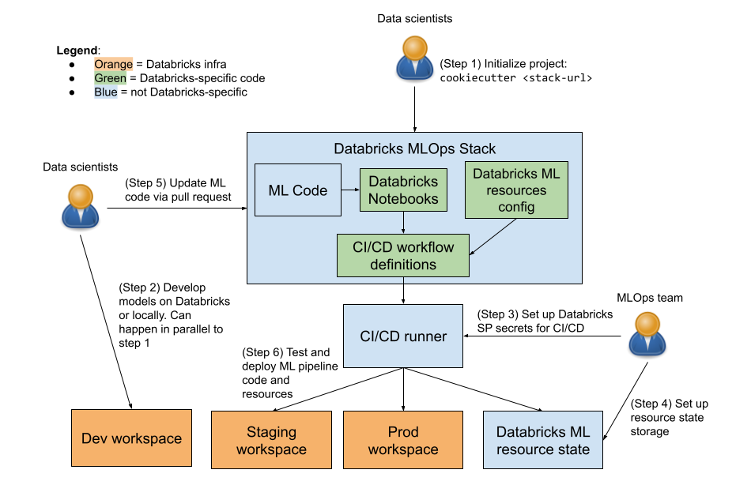

# Databricks MLOps Stack

> **_NOTE:_**  This feature is in [private preview](https://docs.databricks.com/release-notes/release-types.html). The interface/APIs may change and no formal support is available during the preview. However, you can still create new production-grade ML projects using the stack.
If interested in trying it out, please fill out this [form](https://docs.google.com/forms/d/e/1FAIpQLSfHXCmkbsEURjQQvtUGObgh2D5q1eD4YRHnUxZ0M4Hu0W63WA/viewform) and you’ll be contacted by a Databricks representative.

This repo provides a customizable stack for starting new ML projects
on Databricks that follow production best-practices out of the box.

The default stack in this repo includes three modular components:

| Component                  | Description                                                                                                                                                           | Why it's useful                                                                                                                                                                         |
|----------------------------|-----------------------------------------------------------------------------------------------------------------------------------------------------------------------|-----------------------------------------------------------------------------------------------------------------------------------------------------------------------------------------|
| ML Code                    | Example ML project structure, with unit tested Python modules and notebooks using [MLflow recipes](https://mlflow.org/docs/latest/recipes.html)                     | Quickly iterate on ML problems, without worrying about refactoring your code into tested modules for productionization later on.                                                        |
| ML Resource Config as Code | ML pipeline resources (training and batch inference jobs, etc) defined through [Terraform](https://docs.microsoft.com/en-us/azure/databricks/dev-tools/terraform/)    | Govern, audit, and deploy changes to your ML resources (e.g. "use a larger instance type for automated model retraining") through pull requests, rather than adhoc changes made via UI. |
| CI/CD                      | [GitHub Actions](https://github.com/actions) or [Azure DevOps](https://azure.microsoft.com/en-gb/products/devops/) workflows to test and deploy ML code and resources | Ship ML code faster and with confidence: ensure all production changes are performed through automation and that only tested code is deployed to prod                                   |


Your organization can use the default stack as is or customize it as needed, e.g. to add/remove components or
adapt individual components to fit your organization's best practices. See the
[stack customization guide](stack-customization.md) for more details.

Using Databricks MLOps stacks, data scientists can quickly get started iterating on ML code for new projects while ops engineers set up CI/CD and ML service state
management, with an easy transition to production. You can also use MLOps stacks as a building block
in automation for creating new data science projects with production-grade CI/CD pre-configured.



See the [FAQ](#FAQ) for questions on common use cases.

## ML pipeline structure and devloop
[See this page](Pipeline.md) for detailed description and diagrams of the ML pipeline
structure defined in the default stack.

## Using this stack

### Prerequisites
 - Python 3.8+
 - [Cookiecutter Python package](http://cookiecutter.readthedocs.org/en/latest/installation.html) >= 2.1.0: This can be installed with pip:

``` bash
$ pip install 'cookiecutter>=2.1.0'
```

### Starting a new project

To create a new project, run:

    cookiecutter https://github.com/databricks/mlops-stack

This will prompt for parameters for project initialization. Some of these parameters are required to get started:
 * ``project_name``: name of the current project
 * ``cloud``: Cloud provider you use with Databricks (AWS, Azure, or GCP)
 * ``cicd_platform`` : CI/CD platform of choice (GitHub Actions or Azure DevOps)

Others must be correctly specified for CI/CD to work, and so can be left at their default values until you're
ready to productionize a model. We recommend specifying any known parameters upfront (e.g. if you know
``databricks_staging_workspace_host``, it's better to specify it upfront):

 * ``mlflow_experiment_parent_dir``: Base Databricks workspace directory under which an MLflow experiment for the
   current project will be created. The service principals used for CI/CD must have "Can Manage" permissions
   ([AWS](https://docs.databricks.com/security/access-control/workspace-acl.html#folder-permissions) |
   [Azure](https://docs.microsoft.com/en-us/azure/databricks/security/access-control/workspace-acl#--folder-permissions) |
   [GCP](https://docs.gcp.databricks.com/security/access-control/workspace-acl.html#folder-permissions)) on this directory.
   We recommend using a dedicated directory for the current project, e.g. `/MLOps/<project_name>`, to isolate resources
   created for different projects.
 * ``databricks_staging_workspace_host``: URL of staging Databricks workspace, used to run CI tests on PRs and preview config changes before they're deployed to production.
   We encourage granting data scientists working on the current ML project non-admin (read) access to this workspace,
   to enable them to view and debug CI test results
 * ``databricks_prod_workspace_host``: URL of production Databricks workspace. We encourage granting data scientists working on the current ML project non-admin (read) access to this workspace,
   to enable them to view production job status and see job logs to debug failures.
 * ``default_branch``: Name of the default branch, where the prod and staging ML resources are deployed from and the latest ML code is staged.
 * ``release_branch``: Name of the release branch. The production jobs (model training, batch inference) defined in this
    repo pull ML code from this branch.
 * ``read_user_group``: Display name of the user group to give read permissions to the ML jobs, integration test job runs, and machine learning resources created for this project. A group with this name must exist in both the staging and prod workspaces. Defaults to "users", which grants read permission to all users in the staging/prod workspaces. You can specify a custom group name e.g. to restrict read permissions to members of the team working on the current ML project.
 * ``include_feature_store``: If selected, will provide [Databricks Feature Store](https://docs.databricks.com/machine-learning/feature-store/index.html) stack components including: project structure and sample feature Python modules, feature engineering notebooks, Terraform resource configs to provision and manage Feature Store jobs, and automated integration tests covering feature engineering and training. Note that the training code provided with this option will not be using MLflow recipes.    

See the generated ``README.md`` for next steps!

## FAQ

### Do I need separate dev/staging/prod workspaces to use this stack?
We recommend using separate dev/staging/prod Databricks workspaces for stronger
isolation between environments. For example, Databricks REST API rate limits
are applied per-workspace, so if using [Databricks Model Serving](https://docs.databricks.com/applications/mlflow/model-serving.html),
using separate workspaces can help prevent high load in staging from DOSing your
production model serving endpoints.

However, you can run the stack against just a single workspace, against a dev and
staging/prod workspace, etc. Just supply the same workspace URL for
`databricks_staging_host` and `databricks_prod_host`. If you go this route, we
recommend using different service principals to manage staging vs prod resources,
to ensure that CI workloads run in staging cannot interfere with production resources.

### I have an existing ML project. Can I productionize it using this stack?
Yes. Currently, you can instantiate a new project from the stack and copy relevant components
into your existing project to productionize it. The stack is modularized, so
you can e.g. copy just the GitHub Actions workflows under `.github` or Terraform
config under `databricks-config` into your existing project.

### Can I adopt individual components of the stack?
For this use case, we recommend instantiating the full stack via `cookiecutter`
and copying the relevant stack subdirectories. For example, all ML resource config
is defined under `databricks-config`, while CI/CD is defined e.g. under `.github`
if using GitHub Actions, or under `.azure` if using Azure DevOps.

### Can I customize this stack?
Yes. We provide the default stack in this repo as a production-friendly starting point for MLOps.
However, in many cases you may need to customize the stack to match your organization's
best practices. See [the stack customization guide](stack-customization.md)
for details on how to do this.

### Does the MLOps stack cover data (ETL) pipelines?

While some components of the MLOps stack can be re-used and customized for ETL pipelines,
the focus of the Databricks MLOps stack is on productionizing ML workflows: feature engineering, training, model deployment, batch inference, etc.
You might find the following resources useful for data processing:
* [Delta Live Tables](https://docs.databricks.com/workflows/delta-live-tables/index.html): a framework for declaring ETL pipelines on Databricks.
* [dlt-meta](https://github.com/databricks/dlt-meta): an example stack with CI/CD for [Delta Live Tables](https://docs.databricks.com/workflows/delta-live-tables/index.html) pipelines.

Note that the MLOps Stack supports [Databricks Feature Store](https://docs.databricks.com/applications/machine-learning/feature-store/index.html#why-use-databricks-feature-store),
which is integrated with model training and serving. You can provision, manage and deploy feature engineering pipelines that create and write to Feature Store tables.

If you do want to extend the Databricks MLOps stack for ETL and have questions or feature requests, please reach out as explained below.

### How can I provide feedback?

Please provide feedback (bug reports, feature requests, etc) via GitHub issues.

## Contributing

We welcome community contributions. For substantial changes, we ask that you first file a GitHub issue to facilitate
discussion, before opening a pull request.

This stack is implemented as a [cookiecutter template](https://cookiecutter.readthedocs.io/en/stable/)
that generates new projects given user-supplied parameters. Parametrized project code can be found under
the `{{cookiecutter.project_name}}` directory.

### Installing development requirements

To run tests, install [actionlint](https://github.com/rhysd/actionlint),
[terraform](https://learn.hashicorp.com/tutorials/terraform/install-cli), [npm](https://docs.npmjs.com/downloading-and-installing-node-js-and-npm), and
[act](https://github.com/nektos/act), then install the Python
dependencies listed in `dev-requirements.txt`:

    pip install -r dev-requirements.txt

### Running the tests
**NOTE**: This section is for open-source developers contributing to the default stack
in this repo.  If you are working on an ML project using the stack (e.g. if you ran `cookiecutter`
to start a new project), see the `README.md` within your generated
project directory for detailed instructions on how to make and test changes.

Run unit tests:

```
pytest tests
```

Run all tests (unit and slower integration tests):

```
pytest tests --large
```

Run integration tests only:

```
pytest tests --large-only
```

### Previewing stack changes
When making changes to the stack, it can be convenient to see how those changes affect
an actual new ML project created from the stack. To do this, you can create an example
project from your local checkout of the stack, and inspect its contents/run tests within
the project.

We provide example project configs for Azure (using both GitHub and Azure DevOps) and AWS (using GitHub) under `tests/example-project-configs`.
To create an example Azure project, using Azure DevOps as the CI/CD platform, run the following from the desired parent directory
of the example project:

```
# Note: update MLOPS_STACK_PATH to the path to your local checkout of the stack
MLOPS_STACK_PATH=~/mlops-stack
cookiecutter "$MLOPS_STACK_PATH" --config-file "$MLOPS_STACK_PATH/tests/example-project-configs/azure/azure-devops.yaml" --no-input --overwrite-if-exists
```

To create an example AWS project, using GitHub Actions for CI/CD, run:
```
# Note: update MLOPS_STACK_PATH to the path to your local checkout of the stack
MLOPS_STACK_PATH=~/mlops-stack
cookiecutter "$MLOPS_STACK_PATH" --config-file "$MLOPS_STACK_PATH/tests/example-project-configs/aws/aws-github.yaml" --no-input --overwrite-if-exists
```
