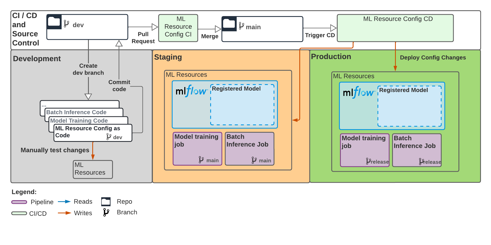

# Databricks ML resource config
[(back to main README)](../README.md)

## Table of contents
* [Intro](#intro)
* [Prerequisites](#prerequisites)
* [Deploy initial ML resources](#deploy-initial-ml-resources)
* [Develop and test config changes](#develop-and-test-config-changes)

## Intro

This directory (`databricks-config`) includes Databricks ML resource configuration, i.e. the definitions of a batch
inference job, a training job, an MLflow experiment, and an MLflow model.
Configurations are split into separate `staging` and `prod` subdirectories
for separate environments (separate staging/prod Databricks workspaces), and are expressed in
the [Terraform language](https://developer.hashicorp.com/terraform/language#terraform-language-documentation).

Managed configs are not defined for dev, but you can manually test changes to staging/prod configs by
creating identical resources in dev and verifying their behavior.

This project ships with CI/CD workflows for developing and deploying ML resource config. You can open a PR (pull request) to modify configs in staging and prod,
which will be unit-tested and then deployed after the PR is merged:



## Prerequisites

### Configure remote state storage and CI/CD
**If you or your ops team have already run the setup scripts under `.mlops-setup-scripts`,
you can skip this section**

Otherwise, we recommend that you or your ops team run the setup scripts documented in [.mlops-setup-scripts](../.mlops-setup-scripts/README.md) to
provision a remote backend for storing the state of provisioned ML resources, and configure CI/CD
with the appropriate credentials to access remote state.

#### More detail

To track the state of deployed ML resources with Terraform, you must:
1. Provision a [remote state backend](https://developer.hashicorp.com/terraform/language/settings/backends/configuration) and
2. Configure Terraform to store state in the remote backend. 

By default, this repo is configured to store resource state in a dedicated
 Azure Blob Storage container  S3 bucket ,
defined in `staging/provider.tf` and `prod/provider.tf`. However, the repo does not automatically provision the
remote state storage location for you, nor does it store credentials in CI/CD for accessing remote state files.

We recommend that you or your ops team
run the scripts under [.mlops-setup-scripts](../.mlops-setup-scripts/README.md) to provision the
expected remote state backend and store credentials in CI/CD.

Alternatively, you can follow
[Terraform docs](https://developer.hashicorp.com/terraform/language/settings/backends/configuration) to specify a custom remote state
backend in `staging/provider.tf` and `prod/provider.tf`, store credentials for accessing the backend in CI/CD,
and configure the `.github/workflows/terraform-ci.yml` and `.github/workflows/terraform-cd.yml` workflows
to authenticate to the remote backend. If using the Terraform Cloud backend, make sure your Terraform workspace is configured
to [execute plans locally](https://www.terraform.io/cloud-docs/workspaces/settings#execution-mode).
Authentication to Databricks REST APIs will not work if plans are executed remotely.


## Deploy initial ML resources
After completing the prerequisites, create and push a PR branch adding
the contents of `databricks-config` to the Git repo:
```
git checkout -b add-ml-resource-config
git add databricks-config
git commit -m "Add ML resource config"
git push upstream add-ml-resource-config
```
Open a pull request from the pushed branch. 
CI will run and comment on the PR with a preview of the resources to be deployed.
Once CI passes, merge the PR to deploy an initial set of ML resources.

Then, follow the next section to configure the input and output data tables for the
batch inference job.

### Setting up batch inference job
The batch inference job expects an input Delta table that with a schema that your registered model accepts. To use the batch
inference job, set up such a Delta table in both your staging and prod workspace.
Then, resolve the TODOs in `staging/inference-job.tf` and `prod/inference-job.tf`, passing
the name of the input Delta table and the name of the output Delta table to which to write
batch predictions as job parameters.

As the batch job will be run with the credentials of the service principal that provisioned it, make sure that the service
principal corresponding to a particular environment has permissions to read the input Delta table and modify the output Delta table in that environment's workspace. If the Delta table is in the [Unity Catalog](https://www.databricks.com/product/unity-catalog), these permissions are

* `USAGE` permissions for the catalog and schema of the input and output table.
* `SELECT` permission for the input table.
* `MODIFY` permission for the output table if it pre-dates your job.

## Develop and test config changes
To get started, open `staging/inference-job.tf`.  The file contains the ML resource definition of
a batch inference job, like:

```$xslt
resource "databricks_job" "batch_inference_job" {
  name = "{{cookiecutter.project_name}} batch inference job"

  new_cluster {
    num_workers   = 3
    spark_version = "11.0.x-cpu-ml-scala2.12"
    node_type_id  = "{{cookiecutter.cloud_specific_node_type_id}}"
  }

  notebook_task {
    notebook_path = "notebooks/BatchInference"
  }
  ...
}
```

The example above defines a Databricks job with name `{{cookiecutter.project_name}} batch inference job`
that runs the notebook under `notebooks/BatchInference.py` to regularly apply your ML model
for batch inference. 

At the start of the resource definition, we specify its type (`databricks_job`)
and assign it the local name ``batch_inference_job``. The local name is a variable
name that allows referencing the job within the same ``.tf`` file, but has no bearing
on the job's name in Databricks.

To test out a config change, simply edit one of the fields above, e.g. 
increase cluster size by bumping `num_workers` from 3 to 4. 
The list of supported fields and additional examples for all Databricks resources can be found in the 
[Databricks Terraform Provider docs](https://registry.terraform.io/providers/databricks/databricks/latest/docs/resources/job).
In general, the field names and types match those provided by the Databricks REST API.

You can then open a PR. Continuous integration will validate the updated config and display a diff
of any config changes for review. You can create resources with identical config manually in your dev workspace
and verify that they behave as expected.

In this example, we walked through modifying an attribute of an existing resource, i.e. increasing the
size of a job cluster. You can also add or remove resource blocks to create or delete resources.

### See also
* [Databricks Terraform Provider docs](https://registry.terraform.io/providers/databricks/databricks/latest/docs/resources/job) for the supported fields and additional examples for Databricks resources
* Official docs on [Terraform resource syntax](https://developer.hashicorp.com/terraform/language/resources/syntax#resource-syntax)

## Deploy config changes

Once you've tested config changes in dev and are ready to deploy them to a pre-production or production
environment, you can merge a PR updating `.tf` files under `staging/` and/or
`prod/`. In general, we recommend keeping staging and prod consistent, so most PRs should update both files.

When your PR merges, continuous deployment automation will deploy changes to staging and then prod.

[Back to main project README](../README.md)
